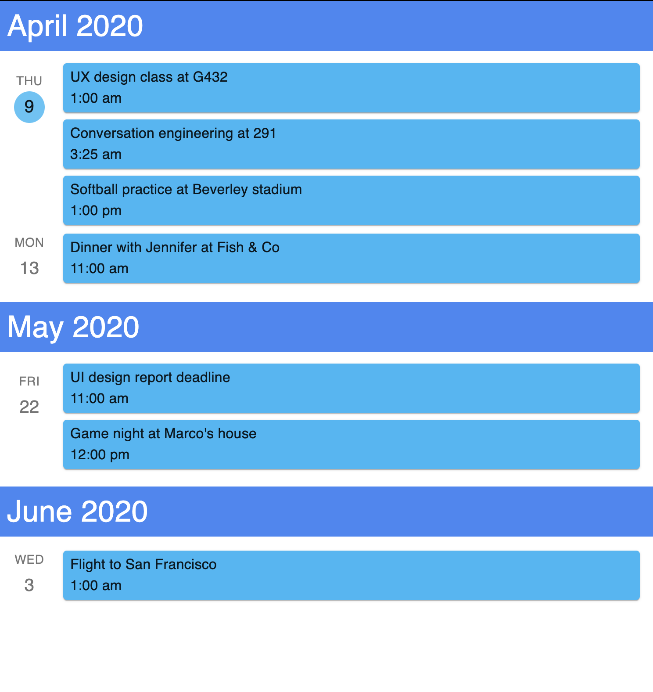

[](https://travis-ci.com/98sean98/mui-event-list)

# Mui Event List

A Google calendar inspired event list using Material-UI for React.

## Installation

This package depends on [Material-UI](https://material-ui.com) components, so make sure you have it installed.

```shell script
npm i @material-ui/core
```

To install this package,

```shell script
npm i mui-event-list
```

## Usage

### Out-of-the-box

Import `MuiEventList` into any of your components.

```javascript
import MuiEventList from "mui-event-list";
```

Construct the component.

```javascript
<MuiEventList data={data} />
```

`data` object is an array of events you want to display, in the format:

```javascript
data = event[];
interface event {
  dateTime: Date | string; // required
  description?: string; // optional
  location?: string; // optional
}
```

`MuiEventList` will sort your `data` according to `dateTime` property in ascending order, and display each `event` by groups of dates and months.

The component is designed to be styled according to the `ThemeProvider` you are using in the higher order components. If none has been provided, the default theme provided by Material-UI shall be used.



### Advanced

#### Styling and Theming

To apply custom styling specific to `MuiEventList`, you may wrap `ThemeProvider` like so.

```javascript
<ThemeProvider theme={customTheme}>
  <MuiEventList data={data} />
</ThemeProvider>
```

More information can be found on [Material-UI's theming guide](https://material-ui.com/customization/theming/).

#### Custom Components

You can build your own components to be integrated into `MuiEventList`. For example, you can design and use a unique `MonthBlock`.

**Adhere to the API** provided, and pass your component like so:

```javascript
// using class components
class MonthBlock extends React.Component {
  render() {
    return (
      <div>
        <p>this month is: {this.props.dateTime}</p>
      </div>
    )
  }
}

// or using functional components (recommended)
const MonthBlock = props => {
  const { dateTime } = props;
  return (
    <div>
      <p>this month is: {dateTime}</p>
    </div>
  )
}

<MuiEventList data={data} components={{monthBlock: MonthBlock}}
```

## API Reference

[MuiEventList](./README.md)

Name | Type | Required | Description
--- | --- |:---:| ---
data | array | yes | A list of `events` to be rendered.
components | `{ monthBlock, eventBlock, listIcon }` | no | To pass in custom components that override the ui.

[MonthBlock](./src/components/month-block/MonthBlock.tsx)


**Props**

Name | Type | Example | Description
--- | --- | --- | ---
dateTime | Date | `2020-05-09T10:25:14.123Z` | `dateTime` value of first event part of a group of events falling under the same month.

[EventBlock](./src/components/grid-events/EventBlock.tsx)


**Props**

Name | Type | Example | Description
--- | --- | --- | ---
event | `{ date: Date, description?: string, location?: string }` | `{ date: 2020-04-09T10:25:14.123Z, description: "Conversation engineering", "location": "291" }` | Event objects passed as an array in `data`.

[ListIcon](./src/components/list-icon/ListIcon.tsx)


**Props**

Name | Type | Example | Description
--- | --- | --- | ---
dateTime | Date | `2020-04-09T10:01:14.123Z` | `dateTime` value of first event part of a group of events falling under the same date.
